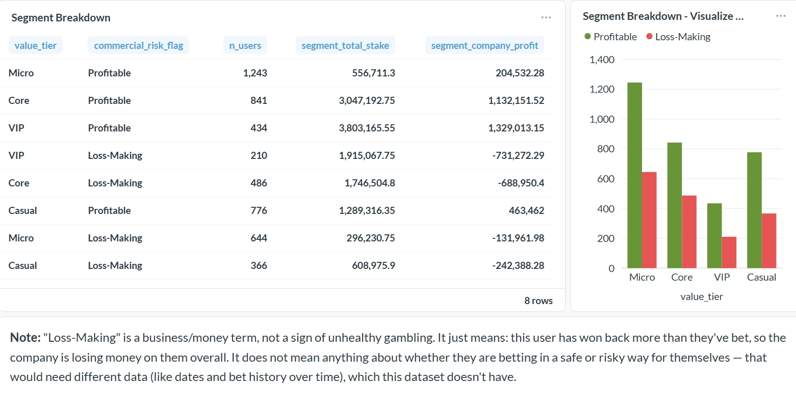
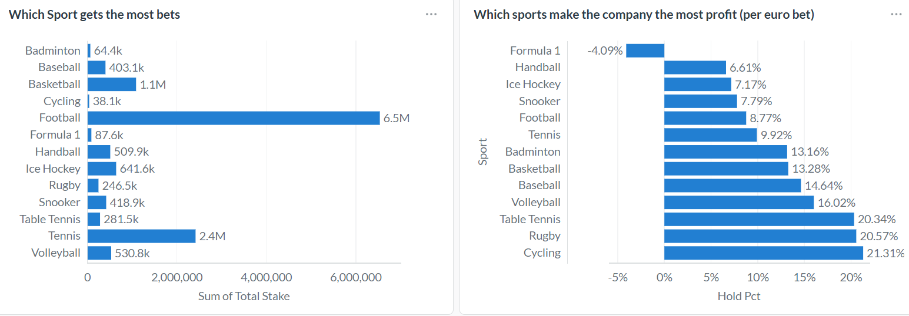

# Results — User Value & Commercial-Risk Segments

## The Basics

| Metric | Value |
|---|---|
| Total money bet | €13.26M |
| Company profit | €1.33M |
| Users | 5,000 |
| Users flagged "Loss-Making" | 1,706 (34%) |
| Money that group is costing | -€1.79M |

## How Users Were Grouped

**Value** — based on total stake per user:
- Under €1,000 → Micro
- €1,000–2,500 → Casual
- €2,500–5,000 → Core
- Over €5,000 → VIP

Cutoffs were chosen by reviewing how total stake is actually distributed across the user base, then rounding to a sensible split.

**Commercial risk** — one check: is the company's total profit from this user negative? If a user has won back more than they've staked overall, the company is genuinely losing money to them — flagged "Loss-Making." Everything else is "Profitable."

## Segment Breakdown

| Value Tier | Risk | Users | Total Bet | % of Money Bet | Company Profit/Loss |
|---|---|---|---|---|---|
| VIP | Loss-Making | 210 | €1.92M | 14.4% | -€731.3K |
| VIP | Profitable | 434 | €3.80M | 28.7% | +€1.33M |
| Core | Loss-Making | 486 | €1.75M | 13.2% | -€689.0K |
| Core | Profitable | 841 | €3.05M | 23.0% | +€1.13M |
| Casual | Loss-Making | 366 | €609.0K | 4.6% | -€242.4K |
| Casual | Profitable | 776 | €1.29M | 9.7% | +€463.5K |
| Micro | Loss-Making | 644 | €296.2K | 2.2% | -€132.0K |
| Micro | Profitable | 1,243 | €556.7K | 4.2% | +€204.5K |

## Main Finding

VIP and Core "Loss-Making" users, combined, cause most of the damage. Those two groups are only 696 users — under 14% of everyone — but together they account for -€1.42M, nearly 80% of all money lost across every "Loss-Making" group.

At the same time, "Profitable" VIPs are the most valuable group per person by far: 434 users generating +€1.33M, an average of about +€3,062 each — more than double the average for a Profitable Core user. The same VIP label can mean either the company's best customer or one of its biggest problems, depending on the commercial-risk flag. That's why value and risk need to be looked at together, not as one score.

## Supporting Analysis — By Sport

**Volume (which sports get the most bets):** Football dominates at €6.54M, followed by Tennis (€2.42M) and Basketball (€1.09M).

**Margin (hold rate — % of each euro bet the company keeps):** Cycling (21.3%), Rugby (20.6%), and Table Tennis (20.3%) are the most profitable per euro bet. Football, despite being the highest-volume sport, sits mid-table on margin at 8.8%. Formula 1 is the outlier — negative hold (-4.1%), meaning users won more than they bet overall.

This shows volume and margin diverge: the sport driving the most stake isn't the sport driving the most profit per euro.

## Supporting Analysis — By Bet Type

| Bet Type | Bets | Avg Stake | Win Rate | Profit Rate |
|---|---|---|---|---|
| Single | 65,014 | €133.01 | 39.1% | 10.5% |
| Multiple | 34,986 | €131.93 | 31.6% | 9.2% |

Multi-part bets have a lower win rate, as expected — every selection needs to win. But they don't actually generate more profit per euro than single bets.

## A Real Limit of This Data

There are no dates or timestamps in the source file, so betting patterns over time can't be examined — for example, whether someone raises their bets right after a loss, one of the biggest warning signs real gambling companies watch for regarding player welfare. This project can only say who is costing the company money, not why, or whether it overlaps with a responsible-gambling concern. That would need a data source with dates and review from a compliance team.
